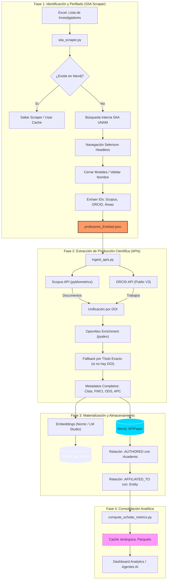

# Sinapsis AI - Hub de Ciencia Abierta
Sistema de Inteligencia Bibliométrica Híbrida y Orquestador RAG para entidades académicas.

## 🛠 Requisitos Previos

- **Python 3.10+** (Recomendado 3.12)
- **Docker y Docker Compose** (Para levantar las bases de datos locales: Neo4j y Qdrant)
- **Git**

## 🚀 Instalación y Configuración Básica

1. **Clonar el Repositorio**
   (Si vas a montarlo en un servidor donde los volúmenes de Docker están en un disco externo como `/mnt/expansion/dockers_drives/`, se recomienda clonar en el _Home_ `~` y ejecutar dockers desde ahí).
   ```bash
   git clone https://github.com/chilti/sinapsisai.git
   cd sinapsisai
   ```

2. **Crear y Activar un Entorno Virtual**
   En Windows:
   ```powershell
   python -m venv venv
   .\venv\Scripts\Activate
   ```
   En Linux/Mac:
   ```bash
   python3 -m venv venv
   source venv/bin/activate
   ```

3. **Instalar Dependencias**
   ```bash
   pip install -r requirements.txt
   ```
   *(Nota de solución de problemas: Si en Streamlit sale el error `ModuleNotFoundError: No module named 'numpy.rec'`, ajusta la versión de numpy con `pip install "numpy<2" pandas` dado que ciertas librerías aún no están migradas completamente a Numpy v2).*

4. **Levantar las Bases de Datos (Docker)**
   El sistema está diseñado para integrarse con **Neo4j** (Grafo de Conocimiento), **Qdrant** (Base de datos vectorial) y opcionalmente **ClickHouse** (Para analítica global).
   ```bash
   docker compose up -d
   ```
   *Nota sobre infraestructura: En el archivo `docker-compose.yml` los volúmenes están direccionados hacia `/mnt/expansion/dockers_drives/` para el ambiente en producción. Si se está corriendo en un entorno local, modificar a `./neo4j_data` etc. antes de levantar.*

5. **Configurar las Credenciales en `.env`**
   Configura las llaves del LLM y los endpoints.
   ```env
   # Ejemplo de archivo .env
   LLM_BASE_URL=http://localhost:1234/v1/
   EMBEDDING_MODEL=nomic-embed-text
   EMAIL_ADDRESS=correo_contacto_openalex@ejemplo.com
   ```

## 🔄 Flujo de Ingesta (Setup de una Nueva Instancia / Entidad)

Para cargar información de una nueva institución (por ejemplo, **"Facultad de Ciencias"**), debes ejecutar de manera secuencial los siguientes scripts de ingesta y enriquecimiento.

### 📊 Diagrama Detallado de Extracción de Producción Científica



### 1. Ingesta Inicial y Lista de Académicos
1. **Ingestar Artículos Locales Iniciales (Web of Science / Scopus export)**
   Carga una lista base de publicaciones institucionales.
   ```bash
   python ingestion/ingest_entity_docs.py --file "data/Facultad_Ciencias_wos.txt" --entity "Facultad de Ciencias"
   ```
2. **Scraping del Padrón de Investigadores (SIIA)**
   Extrae perfiles de investigadores desde un Excel de entrada.
   ```bash
   python ingestion/siia_scraper.py --file "data/Lista_Facultad_Ciencias.xlsx" --entity "Facultad de Ciencias"
   ```
   *(Generará un archivo JSON como `profesores_Facultad_de_Ciencias.json`)*

### 2. Enriquecimiento Primario (APIs)
3. **Ingestar y Enriquecer con APIs Globales (OpenAlex, OAK, Scopus)**
   Descarga metadata detallada para los artículos de cada investigador en el JSON.
   ```bash
   python ingestion/ingest_apis.py ingestion/profesores_Facultad_de_Ciencias.json
   ```

### 3. Generación de Indicadores Secundarios (Nuevos campos)
4. **Completar campos de OpenAlex en toda la DB**
   Asegura que todos los papers tengan los ~60 indicadores nuevos (velocidad de citas, APC, licencias OA, colaboración).
   ```bash
   python ingestion/patch_all_openalex_fields.py --entity "Facultad de Ciencias"
   ```
5. **Inferir Género de Investigadores**
   Utiliza Genderize.io para etiquetar el género de los académicos cargados.
   ```bash
   python ingestion/infer_gender.py --entity "Facultad de Ciencias"
   ```
6. **Parchear Afiliaciones de Coautores**
   Enriquece los nodos de autores externos (`:Author`) con países e instituciones. Vital para métricas de colaboración internacional.
   ```bash
   python ingestion/patch_author_affiliations.py --entity "Facultad de Ciencias"
   ```

### 4. Estructuración del Grafo Temático y Relacional
7. **Extraer Nodos Temáticos**
   Extrae campos `primary_topic` y genera nodos `(:Topic)` y relaciones `(:TopicHierarchy)`.
   ```bash
   python ingestion/extract_topics.py
   ```
8. **Auto-Clasificación ODS con LLM Local**
   Se conecta al LLM (ej. LM Studio en puerto 1234) para inferir y asignar el ODS principal del Abstract de cada artículo.
   ```bash
   python ingestion/ingest_sdg.py
   ```
9. **Materializar Red de Citas**
   Crea las relaciones explícitas `(p1:Paper)-[:CITES]->(p2:Paper)` usando el array `referenced_works` de OpenAlex.
   ```bash
   python ingestion/materialize_citations.py --entity "Facultad de Ciencias"
   ```

### 5. Finalización y Caché para el Dashboard
10. **Parchear Payload en Qdrant (Para búsqueda semántica avanzada)**
    Actualiza la base de datos vectorial con los nuevos campos filtrables (idioma, OA, países, FWCI).
    ```bash
    python ingestion/patch_qdrant_payload.py --both
    ```
11. **Computar las Métricas Analíticas y Tableros (Caché Parquet)**
    Precalcula métricas de excelencia (Top 10%, Gini, Velocidad), Sunburst temático, KPIs por investigador/institución y proyeción UMAP. 
    **Nota Arquitectónica:** El sistema utiliza una arquitectura de **Caché Desagregada**, agrupando los `.parquet` en directorios jerárquicos veloces alineados estrictamente al padrón institucional (`data/cache/<Institución>/<Dependencia>/...`). Requerido para cada institución de manera individual.
    ```bash
    python ingestion/compute_scholar_metrics.py --entity "Facultad de Ciencias"
    ```

### 6. Pipeline Nacional (SNII Matching y Verificación)
Para implementaciones a escala país (como la validación de los +40,000 miembros del SNII contra repositorios abiertos), el pipeline incluye un submódulo de vinculación híbrida y vectorial:
12. **Vectorización y Limpieza de Padrón Local**
    Crea embeddings de los investigadores priorizando datos de la universidad base contra el resto.
    ```bash
    python SNII/vectorize_researchers.py --step 1
    ```
13. **Validación Híbrida con LLMs (Orquestación RAG)**
    Utiliza búsqueda de ClickHouse/Qdrant combinada con un LLM como juez absoluto para desambiguar homónimos y limpiar jerarquías.
    ```bash
    python SNII/match_snii_orcid.py
    ```
12. **Carga y Cálculo en ClickHouse (Rendimiento Masivo)**
    Si requieres analizar datasets masivos a nivel país o región (millones de registros), la ingesta puede derivarse a ClickHouse.
    ```bash
    python clickhouse/load_openalex_clickhouse.py
    python clickhouse/compute_metrics_clickhouse.py
    ```

13. **Generación de Reportes Automatizados con IA**
    El sistema puede redactar e interpretar reportes en HTML tipo "Journal" alimentándose de los parquets locales. El dashboard invoca automáticamente este script, o se puede usar de forma stand-alone:
    ```bash
    python report_generator.py --type inst --name "Facultad de Ciencias"
    ```

## 📊 Interfaz Dashboard

Finalmente, corre la interfaz basada en Streamlit:
```bash
streamlit run .\dashboard_v2.py
```
Accede desde el navegador al puerto especificado que aparezca en pantalla (usualmente 8501) para interactuar con la Base de Grafo, el Agente y el Hub Analítico completo.
