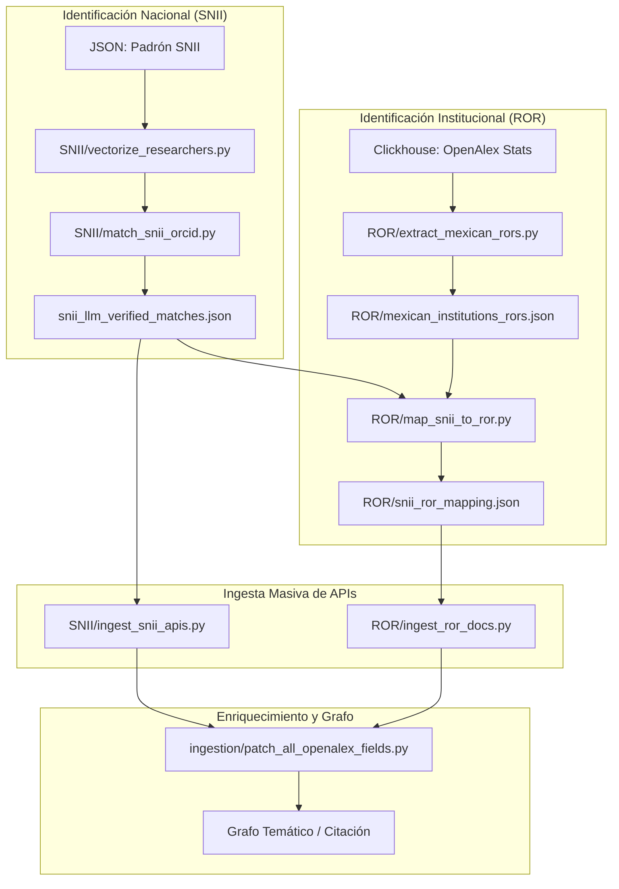

# Pipeline Nacional: SNII y Cobertura ROR

Este documento describe el flujo de trabajo para cargar y analizar datos a escala nacional (México), integrando el padrón del **SNII** (Sistema Nacional de Investigadores) y la producción institucional mediante identificadores **ROR**.

## 📌 Resumen del Flujo Nacional

El objetivo es poblar el sistema con la producción de investigadores de todo el país y las instituciones mapeadas en el ROR.



---

## 1. Identificación y Matching de Investigadores (SNII)

Este proceso vincula los nombres del padrón SNII con perfiles reales en OpenAlex/ORCID.

1.  **Vectorización del Padrón**:
    ```bash
    python SNII/vectorize_researchers.py --step 1
    ```
2.  **Matching Híbrido (Búsqueda + LLM)**:
    Este script utiliza búsqueda vectorial y un LLM para desambiguar homónimos.
    ```bash
    python SNII/match_snii_orcid.py
    ```
    *Salida:* `data/snii_llm_verified_matches.json`

---

## 2. Cobertura Institucional (ROR)

Para capturar la producción de instituciones completas (más allá de los individuos en el SNII).

1.  **Extraer Catálogo de RORs Mexicanos**:
    Requiere ClickHouse local con datos de OpenAlex.
    ```bash
    python ROR/extract_mexican_rors.py
    ```
2.  **Mapear Entidades SNII a ROR**:
    Vincula las instituciones declaradas por los investigadores con registros ROR oficiales.
    ```bash
    python ROR/map_snii_to_ror.py
    ```
3.  **Ingesta por ROR**:
    Descarga toda la producción de las instituciones mapeadas.
    ```bash
    python ROR/ingest_ror_docs.py
    ```

---

## 3. Ingesta de Publicaciones (SNII)

Una vez verificados los investigadores, se descargan sus publicaciones:
```bash
python SNII/ingest_snii_apis.py
```
> [!TIP]
> Puedes usar el flag `--local` para evitar límites de API si tienes una instancia local de OpenAlex en el puerto 5009.

---

## 4. Enriquecimiento Obligatorio (Indicadores Avanzados)

> [!IMPORTANT]
> Los scripts de ingesta masiva (`ingest_snii_apis.py` y `ingest_ror_docs.py`) descargan metadatos básicos por velocidad. Para tener acceso a métricas de excelencia (FWCI, APC, Top 10%, etc.), **DEBES** ejecutar el parche:

```bash
python ingestion/patch_all_openalex_fields.py
```
Este script unifica la metadata de todos los artículos en la base de datos consultando los campos granulares de OpenAlex.

---

## 5. Estructuración y Analítica

Sigue los pasos **4 y 5** del [README principal](../README.md) para construir el grafo temático y generar la caché de indicadores para el Dashboard.

### Uso de ClickHouse (Opcional - Alto Rendimiento)
Para datasets de millones de registros, se recomienda mover la analítica pesada a ClickHouse:
```bash
python clickhouse/load_openalex_clickhouse.py
python clickhouse/compute_metrics_clickhouse.py
```
