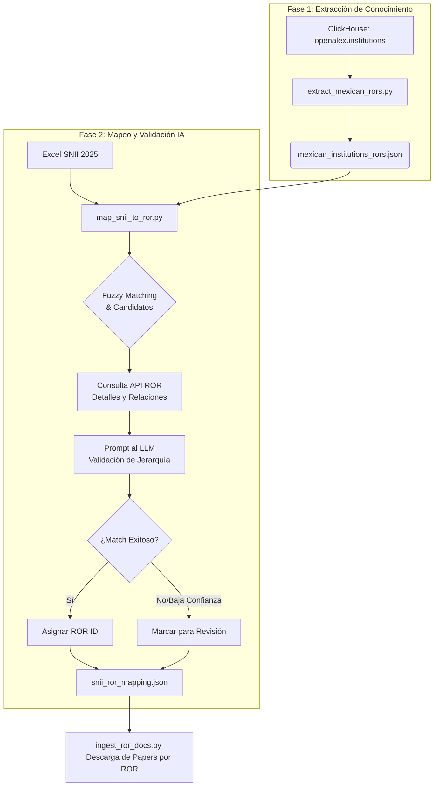

# Mapeo de Instituciones SNII a Registros ROR

Este documento describe el flujo de trabajo para identificar y asignar identificadores **ROR (Research Organization Registry)** a las instituciones y subdependencias mencionadas en el padrón del SNII 2025.

## Flujo de Trabajo

El proceso se divide en dos fases: extracción de la base de conocimiento global y mapeo específico mediante Inteligencia Artificial.

## Componentes del Proceso

### 1. Extracción de Base de Datos (`extract_mexican_rors.py`)
Este script actúa como el recolector de la "verdad terrestre" (Ground Truth) de OpenAlex.
- **Filtro**: Extrae únicamente instituciones con `country_code = 'MX'` y que posean un `ror` válido.
- **Salida**: Genera `mexican_institutions_rors.json`, que sirve como catálogo local para evitar búsquedas lentas en la API de ROR durante la fase de matching inicial.

### 2. Mapeo Inteligente (`map_snii_to_ror.py`)
Este es el núcleo de la lógica de normalización institucional de Sinapsis AI.
- **Fuzzy Matching**: Utiliza la librería `thefuzz` para encontrar los candidatos más cercanos por nombre entre los investigadores del SNII y el catálogo local.
- **Enriquecimiento en Tiempo Real**: Para los candidatos con mejores puntuaciones, el script consulta la **API oficial de ROR** (`api.ror.org`) para obtener:
    - **Aliases**: Nombres alternativos o siglas (ej: UNAM, IPN).
    - **Relationships**: Parent/Child/Facilitiy para entender si un registro es una sub-unidad de otro.
- **Validación por LLM**: Se envía un prompt detallado a un modelo de lenguaje que evalúa:
    - Si la subdependencia solicitada (ej: "Facultad de Ingeniería") tiene su propio ROR o debe usar el de la Institución principal.
    - Si el ROR candidato realmente pertenece a la jerarquía de la universidad mencionada.
- **Prevención de Sesgo**: El prompt está diseñado para evitar asignar el ROR de la institución padre (Universidad) a una subdependencia que no tiene ROR registrado, prefiriendo dejarlo nulo antes que asignar un ID impreciso.

## Resultados
El archivo final `ROR/snii_ror_mapping.json` contiene la relación mapeada con campos de `confidence` y `reason`, permitiendo auditar por qué la IA eligió un ROR específico.
