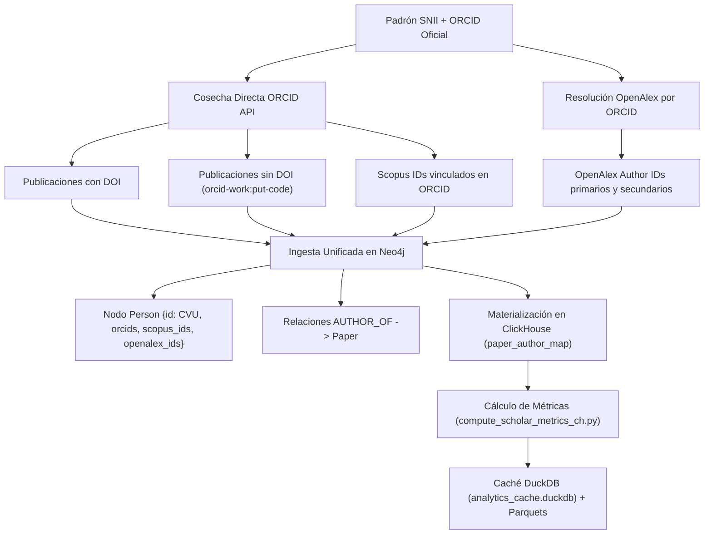

# Plan de Optimización: Resolver de Identidades SNII, Soporte Multi-ID y Recolección Exhaustiva de Obras

> **Nota de Contexto**: Este documento recopila la arquitectura y pasos para optimizar la resolución de identidades SNII, especialmente de cara a la disponibilidad próxima de los ORCIDs completos de todo el padrón SNII.

---

## 1. Diagnóstico de Limitaciones Actuales

### A. Descarte Erróneo por Movilidad Académica (`snii_llm_identity_resolver.py`)
* **Problema**: El resolver de IA solo enviaba `last_known_institution` de OpenAlex. Si un investigador cambió de adscripción institucional (o tuvo estancias internacionales/posdoctorales recientes), el LLM descartaba el perfil con argumentos como *"Afiliación incorrecta (otra universidad)"*.
* **Solución**: Extraer el historial cronológico de afiliaciones (`affiliations` en OpenAlex con años de publicación) y ajustar las directrices del prompt para contemplar la movilidad institucional.

### B. Pérdida de Obras Cargadas en ORCID sin DOI
* **Problema**: Las publicaciones ingresadas manualmente a ORCID o de revistas sin DOI no se cosechaban si no se resolvía el ORCID en la etapa inicial.
* **Solución**: Cuando se cuente con los ORCIDs del padrón, consultar directamente `https://pub.orcid.org/v3.0/{orcid}/works`, capturando tanto DOIs como identificadores sintéticos `orcid-work:<put-code>`.

### C. Soporte Multi-ID (Listas de Identificadores)
* **Problema**: Varios investigadores tienen múltiples OpenAlex Author IDs (por fragmentación en OpenAlex), múltiples Scopus IDs o múltiples variantes de ORCID.
* **Solución**:
  - Almacenar arrays limpios de `openalex_ids`, `scopus_ids` y `orcids` en Neo4j y ClickHouse.
  - En la recolección, iterar y fusionar las obras de todos los IDs asociados a cada investigador.

### D. Duplicación de Nodos en Neo4j (`EXT_NOMBRE` vs `CVU`)
* **Problema**: Nodos creados previamente por scrapers institucionales (`EXT_NOMBRE`) quedaban desconectados de los nodos creados por el padrón SNII (`CVU`).
* **Solución**: Fusión automática de relaciones `AUTHOR_OF` y `SPECIALIZED_IN` desde `EXT_...` hacia el nodo con `CVU`, eliminando el nodo provisional.

---

## 2. Flujo de Ingesta con ORCIDs Completos del SNII

Cuando se disponga de la lista oficial de ORCIDs para el padrón SNII:

---

## 3. Componentes a Modificar

1. **`SNII/snii_llm_identity_resolver.py`**:
   - Enriquecer candidatos con historial completo de afiliaciones.
   - Prompt con soporte de perfiles fragmentados y movilidad académica.
2. **`SNII/ingest_snii_apis.py` / `ingestion/sync_works.py`**:
   - Bucle de cosecha sobre listas completas de `openalex_ids`, `scopus_ids` y `orcids`.
   - Ingesta de obras `orcid-work:*` en Neo4j y ClickHouse.
   - Inserción completa en `paper_author_map` de todas las obras del autor (no solo las nuevas).
3. **`database/knowledge_graph.py`**:
   - Fusión automática de nodos `EXT_` hacia nodos `CVU`.
   - Limpieza y normalización de arrays de IDs.
4. **`scripts/tools/materialize_paper_author_map.py`**:
   - Soporte para etiquetas `:Person`/`:Author` y relaciones `:AUTHOR_OF`/`:AUTHORED`.
