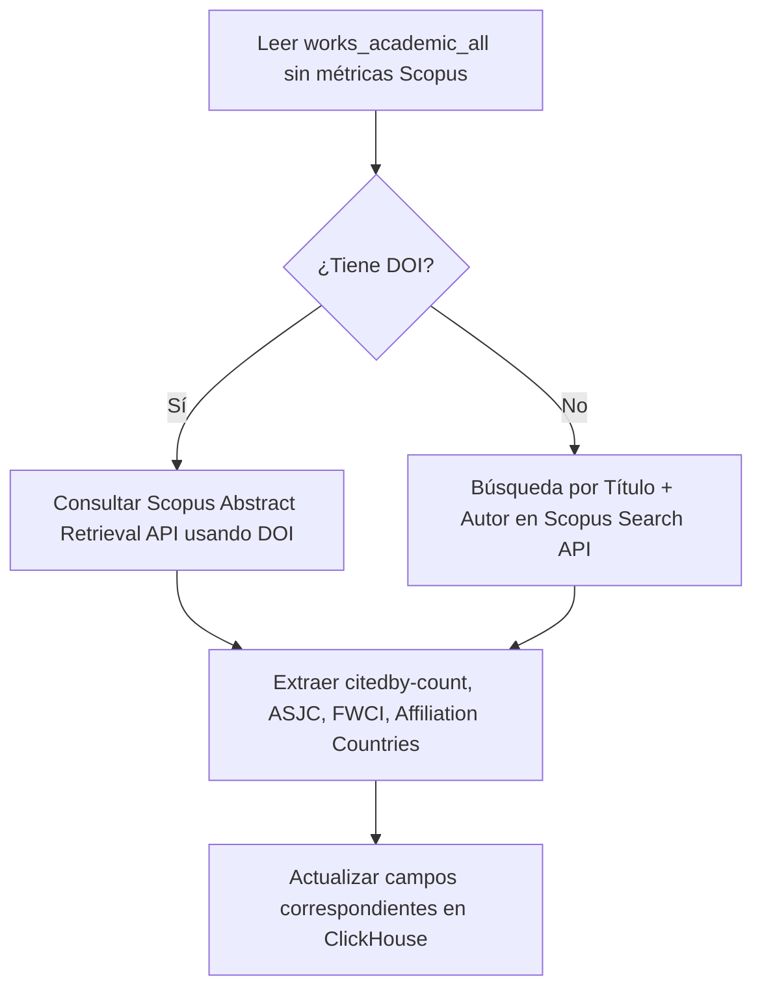

# Valoración de Enriquecimiento con Scopus para `works_academic_all`

Este documento detalla qué campos de la tabla `works_academic_all` (diseñada para evaluar la producción de académicos mexicanos) pueden ser recuperados, enriquecidos o validados utilizando las APIs de Scopus/SciVal.

---

## 1. Contexto Académico Mexicano (SNII / CONAHCYT)

En México, las evaluaciones de investigadores (particularmente en el **SNII**) priorizan las bases de datos de **Scopus** y **Web of Science (WoS)**. Aunque OpenAlex (la base actual) tiene una cobertura excelente, Scopus ofrece un nivel de curación institucional y de autores superior, además de métricas propietarias que los evaluadores consideran "oficiales". Enriquecer `works_academic_all` con Scopus aporta:

* **Métricas Oficiales:** Acceso al **FWCI** (Field-Weighted Citation Impact) real calculado por Elsevier.
* **Clasificación de Revistas:** Énfasis en si una revista es "Core" o indexada activamente en Scopus (criterio de calidad SNII).
* **Desambiguación:** IDs de autor de Scopus sumamente estables para ligar producción.

---

## 2. Mapeo Analítico de Campos de `works_academic_all` a Scopus

A continuación se muestra una categorización de los campos de la tabla y cómo pueden enriquecerse desde las APIs de Scopus (`Scopus Search API` y `Abstract Retrieval API`).

### A. Identificadores y Metadatos Básicos

| Campo en ClickHouse | Viabilidad desde Scopus | Campo Scopus API / Fuente | Nota de Valoración |
| :--- | :--- | :--- | :--- |
| `id` | **N/A** | `dc:identifier` | El `id` de OpenAlex se debe mapear usando el `doi` como llave primaria de cruce. |
| `doi` | **Alta** | `prism:doi` | Utilizado para hacer match entre Scopus y OpenAlex. Scopus tiene casi un 100% de cobertura en DOIs para artículos científicos. |
| `title` | **Alta** | `dc:title` | Permite corregir discrepancias en caracteres especiales y fórmulas presentes en títulos de OpenAlex. |
| `publication_year` | **Alta** | `prism:coverDate` | Extraído del año de la fecha de publicación oficial. |
| `type` | **Alta** | `subtypeDescription` / `prism:aggregationType` | Mapeo directo de tipos de documento de Scopus (Article, Review, Conference Paper, Book Chapter, etc.). |
| `language` | **Alta** | `language` (código de 3 letras) | Idioma oficial del documento registrado en Scopus. |

### B. Métricas de Impacto (Crucial para SNII)

| Campo en ClickHouse | Viabilidad desde Scopus | Campo Scopus API / Fuente | Nota de Valoración |
| :--- | :--- | :--- | :--- |
| `cited_by_count` | **Muy Alta** | `citedby-count` | Las citas en Scopus son el estándar de oro para SNII. Este valor suele diferir de OpenAlex (que incluye literatura gris). Ambas métricas son valiosas, pero la de Scopus es la de validez formal. |
| `fwci` | **Muy Alta** | `fwci` (vía SciVal API o Abstract Retrieval con vista extendida) | El **Field-Weighted Citation Impact** real de Elsevier. OpenAlex genera un aproximado, pero contar con el oficial de SciVal añade alta fidelidad para reportes institucionales. |
| `percentile` | **Media** | `percentile` | Scopus provee percentiles basados en métricas de revistas (CiteScore) y de citación de artículos. |
| `is_top_10` / `is_top_1` | **Media** | Derivado de percentiles | Indicadores binarios derivados directamente de los percentiles de citación del artículo en su área y año. |

### C. Autores y Afiliaciones (Colaboración)

| Campo en ClickHouse | Viabilidad desde Scopus | Campo Scopus API / Fuente | Nota de Valoración |
| :--- | :--- | :--- | :--- |
| `author_names` | **Muy Alta** | `author-group / author` | Scopus tiene un motor de desambiguación muy robusto. Recuperar los nombres normalizados por Scopus evita homónimos comunes en OpenAlex. |
| `institution_ids` / `rors` | **Alta** | `affiliation / @id` (Scopus Affiliation ID) | Scopus no usa ROR directamente en todas sus APIs de manera nativa, pero sus Affiliation IDs están altamente curados y se pueden cruzar externamente con ROR. |
| `institution_names` | **Muy Alta** | `affilname` | Nombres de instituciones normalizados y jerarquizados (ej. "Universidad Nacional Autónoma de México" vs facultades). |
| `all_country_codes` | **Muy Alta** | `affiliation-country` | Permite un cálculo exacto de **Tasa de Colaboración Internacional** y **Nacional**, campo indispensable para las métricas de consolidación de dependencias. |

### D. Clasificación Temática y Áreas de Conocimiento

| Campo en ClickHouse | Viabilidad desde Scopus | Campo Scopus API / Fuente | Nota de Valoración |
| :--- | :--- | :--- | :--- |
| `field` / `subfield` / `domain` | **Muy Alta** | `ASJC Codes` (All Science Journal Classification) | **El valor más alto de Scopus.** Mapear revistas a códigos ASJC permite clasificar los artículos en áreas temáticas estándar de la OCDE y áreas del SNII (ej. Área I: Físico-Matemáticas, Área VII: Ciencias Sociales). |
| `keywords` | **Alta** | `authkey` (Author Keywords) / `indkey` (Indexed Keywords) | Scopus extrae tanto palabras clave de autores como términos indexados (como MeSH en medicina), enriqueciendo la búsqueda semántica. |
| `sdg_ids` / `sdgs` | **Alta** | `sdg` (Mapeo Elsevier) | Elsevier realiza su propio mapeo de Objetivos de Desarrollo Sostenible (ODS/SDG) para cada documento, que difiere ligeramente del modelo de OpenAlex. |

### E. Indexación y Acceso Abierto

| Campo en ClickHouse | Viabilidad desde Scopus | Campo Scopus API / Fuente | Nota de Valoración |
| :--- | :--- | :--- | :--- |
| `is_oa` / `oa_status` | **Alta** | `openaccess` / `openaccessFlag` | Estado de acceso abierto registrado en Scopus (Gold, Hybrid, Bronze, Green). |
| `is_core_journal` / `journal_is_core` | **Crítica** | Activo en Scopus | Permite marcar de manera 100% confiable si el artículo pertenece a una revista indexada actualmente en Scopus, lo cual es requisito sine qua non para el reconocimiento de artículos en SNII niveles II y III. |

---

## 3. Beneficios Directos de Integrar Datos de Scopus

1. **Precisión en Conteos de Citas:** Las citas acumuladas en Scopus suelen ser menores en volumen que en OpenAlex, pero son las únicas válidas ante comisiones del SNII.
2. **Clasificación por áreas del SNII:** Mediante los códigos **ASJC** de Scopus, se puede automatizar la asignación de un artículo a las comisiones de área evaluadoras del SNII con una precisión muy alta.
3. **Identificación de Co-autorías de Elite:** Permite calcular de manera precisa indicadores de redes de coautoría basados en Scopus Author IDs.

---

## 4. Estrategia de Recuperación (Workflow Recomendado)

Para poblar y actualizar estos campos sin saturar las cuotas de la API de Scopus (las cuales tienen límites diarios estrictos):

> [!TIP]
> **Recomendación Técnica:**
> Se sugiere añadir a la tabla `works_academic_all` campos específicos de control de Scopus, por ejemplo:
> * `scopus_id` (String): El identificador único de Scopus (EID).
> * `scopus_cited_by_count` (Int64): Para mantener la comparación diferenciada con `cited_by_count` de OpenAlex.
> * `asjc_codes` (Array(Int32)): Códigos numéricos de clasificación temático-científica de Scopus.
