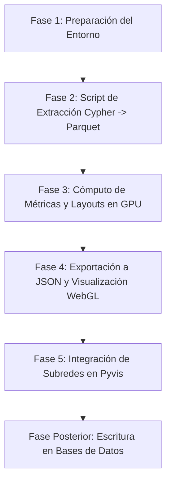

# Plan de Análisis y Visualización de Redes con RAPIDS cuGraph

Este documento detalla las especificaciones técnicas para la construcción, análisis y visualización de tres redes académicas clave utilizando la base de datos de **Neo4j** y aceleración en GPU mediante **RAPIDS cuGraph** en el entorno de Python `/home/ambientesPy/revistaslatam`.

---

## 1. Requisitos y Dependencias de RAPIDS

Dado que ya cuentas con `cugraph-cu12` (v26.04), `cudf-cu12` y `cuml-cu12` instalados en el entorno, **sí es muy recomendable instalar un paquete adicional de RAPIDS**:

### `nx-cugraph-cu12`
Este paquete es el **backend oficial para NetworkX** desarrollado por NVIDIA. 
* **¿Por qué es necesario?** NetworkX 3.2+ cuenta con un mecanismo de despacho de algoritmos (dispatching). Al instalar `nx-cugraph`, puedes escribir código estándar de NetworkX (muy intuitivo y familiar) y el motor delegará automáticamente la ejecución a la GPU mediante `cugraph` si se especifica el backend, o de forma global.
* **Comando para instalarlo**:
  ```bash
  /home/ambientesPy/revistaslatam/bin/pip install nx-cugraph-cu12 --extra-index-url=https://pypi.nvidia.com
  ```

---

## 2. Definición de las Tres Redes Académicas

### Red 1: Coautoría de Académicos (Co-authorship Network)
Esta red modela la colaboración directa entre investigadores a nivel de artículo científico.

* **Nodos**: Investigadores (`Person` con alias `Author`/`SNII`/`Academic`).
* **Aristas**: No dirigidas. Una arista existe entre el Autor A y el Autor B si ambos son coautores de al menos un `Paper`.
  * *Peso de la arista*: Número de publicaciones compartidas (frecuencia de coautoría).
* **Preguntas Científicas/Métricas a Obtener**:
  * **Comunidades (Louvain/Leiden)**: ¿Cuáles son los grupos o clústeres de colaboración real dentro de la UNAM y otras dependencias?
  * **PageRank (Preeminencia)**: ¿Quiénes son los nodos centrales y más consolidados en la red de publicaciones?
  * **Betweenness Centrality (Intermediación)**: ¿Quiénes actúan como "puentes" o intermediarios entre diferentes grupos de investigación, disciplinas o facultades?
* **Consulta Cypher Sugerida para Extracción**:
  ```cypher
  MATCH (p1:Person)-[:AUTHOR_OF]->(w:Paper)<-[:AUTHOR_OF]-(p2:Person)
  WHERE id(p1) < id(p2)
  RETURN p1.id AS source, p2.id AS target, count(w) AS weight
  ```

---

### Red 2: Colaboración Institucional y de Dependencias (Institutional Network)
Esta red eleva la colaboración individual a nivel organizacional, permitiendo analizar la sinergia entre diferentes facultades, institutos y universidades externas.

* **Nodos**: Instituciones (`Institution`), Dependencias (`Dependency`) y Subdependencias (`Subdependency`).
* **Aristas**: No dirigidas. Una arista existe entre la Entidad A y la Entidad B si un investigador de A publicó un artículo con un investigador de B.
  * *Peso de la arista*: Cantidad de artículos conjuntos.
* **Métricas a Obtener**: Degree Centrality, Edge Betweenness y Comunidades.
* **Consulta Cypher Sugerida para Extracción**:
  ```cypher
  MATCH (i1:Institution)<-[:AFFILIATED_TO]-(p1:Person)-[:AUTHOR_OF]->(w:Paper)<-[:AUTHOR_OF]-(p2:Person)-[:AFFILIATED_TO]->(i2:Institution)
  WHERE id(i1) < id(i2)
  RETURN i1.name AS source, i2.name AS target, count(w) AS weight
  ```

---

### Red 3: Red Bipartita Autor-Tópico y ODS (Bipartite Topic/SDG Network)
Un modelo heterogéneo que mapea la especialización y transición temática de los investigadores.

* **Nodos**: Tipo dual (Bipartita). 
  * Conjunto A: Académicos (`Person`).
  * Conjunto B: Conceptos Científicos (`Topic` de OpenAlex) u Objetivos de Desarrollo Sostenible (`SDG`).
* **Aristas**: Dirigidas o no dirigidas. Una arista conecta a un Autor con un Tópico/ODS si el autor tiene publicaciones asociadas a esa temática.
* **Métricas a Obtener**: Hubs & Authorities (HITS) y agrupamiento bipartito.
* **Consulta Cypher Sugerida para Extracción**:
  ```cypher
  MATCH (p:Person)-[:AUTHOR_OF]->(w:Paper)-[:HAS_TOPIC]->(t:Topic)
  RETURN p.id AS source, t.id AS target, count(w) AS weight
  ```

---

## 3. Estrategia de Visualización de Redes

Visualizar grafos grandes en la web es un reto técnico porque dibujar miles de líneas (aristas) simultáneamente puede saturar el navegador y generar un efecto de "madeja de hilo" (hairball) incomprensible. Proponemos un **enfoque de visualización en dos capas (Híbrido)**:

### Capa 1: Macro-Visualización del Grafo Completo (Nodos en WebGL)
* **Objetivo**: Mostrar la estructura global de la red (dónde se forman clústeres, qué investigadores o instituciones orbitan en la periferia y quiénes están en el núcleo).
* **Cómo se calcula**:
  * Usaremos **cuGraph ForceAtlas2** o **FastRP + UMAP** en la GPU para generar coordenadas 2D (`x`, `y`) para cada nodo basadas exclusivamente en la conectividad del grafo.
* **Cómo se renderiza**:
  * Exportaremos estos datos a un archivo JSON idéntico al de los mapas semánticos (`public/tiles/network_coauthorship_data.json`).
  * Utilizaremos el visualizador WebGL existente (`map_test.html`) para dibujar los nodos como puntos interactivos.
  * **Codificación visual**: El **color** del punto representará la comunidad (Louvain/Leiden) calculada por cuGraph, y el **tamaño** del punto representará la importancia (PageRank).

### Capa 2: Micro-Visualización Interactiva (Subredes en HTML/Canvas)
* **Objetivo**: Permitir al usuario explorar las conexiones directas (aristas) al filtrar por investigador, dependencia o tema específico.
* **Cómo se calcula**:
  * Al seleccionar un filtro en el dashboard (ej. "Mostrar red de coautoría del Dr. X" o "Ver colaboraciones del Instituto de Física"), extraeremos el subgrafo local de primer o segundo grado.
* **Cómo se renderiza**:
  * Generaremos un grafo interactivo y animado usando la biblioteca **Pyvis** (basada en HTML5 Canvas con `vis.js`).
  * Los usuarios podrán arrastrar nodos, ver etiquetas de nombres al pasar el cursor y ver físicamente las líneas de conexión (aristas) con grosores proporcionales al número de publicaciones conjuntas.

---

## 4. Plan de Implementación de Redes (Fases)

De acuerdo con tus comentarios, el almacenamiento directo de métricas en Neo4j y ClickHouse se posterga a una **segunda etapa** para priorizar el análisis de resultados en local y la visualización.



### Fase 1: Preparación del Entorno
* **Acción**: Instalar `nx-cugraph-cu12` en el entorno `/home/ambientesPy/revistaslatam`.
* **Prueba**: Validar que `import networkx as nx` y `import cugraph` interactúen sin errores.

### Fase 2: Script de Extracción de Datos
* **Acción**: Crear `networks/extract_graphs.py`.
* **Detalle**: Conectarse a Neo4j mediante Bolt, extraer los listados de aristas para las tres redes y guardarlos como archivos Parquet locales en `data/networks/` para agilizar las iteraciones.

### Fase 3: Cómputo de Métricas y Coordenadas en GPU
* **Acción**: Crear `networks/compute_metrics.py`.
* **Detalle**: 
  1. Cargar las aristas en dataframes de `cuDF`.
  2. Ejecutar **Louvain** (comunidades) y **PageRank** (centralidad).
  3. Ejecutar **ForceAtlas2** (layout de red en GPU) o aplicar **UMAP** sobre embeddings de red para obtener las coordenadas bidimensionales `x` e `y` de los nodos.
  4. Guardar un Parquet unificado con `[node_id, x, y, community, pagerank, metadata]`.

### Fase 4: Preparación y Visualización WebGL (Capa Macro)
* **Acción**: Crear un script `networks/build_network_json.py` (adaptado de `build_map_data.py`).
* **Detalle**: Convertir el Parquet de la Fase 3 en un archivo JSON optimizado (ej. `public/tiles/network_coauthorship_data.json`) y agregar la opción de visualización en el menú del panel `dashboard_maps.py`.

### Fase 5: Visualización de Subredes Interactivas (Capa Micro)
* **Acción**: Crear `networks/build_subgraphs.py`.
* **Detalle**: Usar `Pyvis` para construir archivos HTML temporales que contengan subredes específicas (ej. egoredes de investigadores o colaboraciones entre dependencias UNAM) y embeberlas dinámicamente en el dashboard de Streamlit cuando el usuario seleccione filtros detallados.
