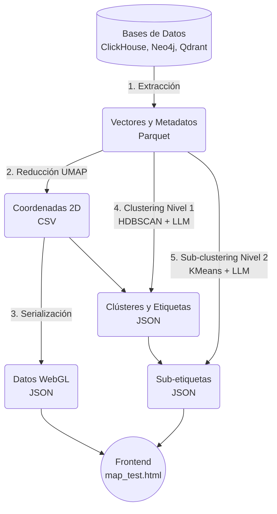

# Pipeline de Mapas Espaciales y Clustering Semántico (Sinapsis AI)

Este directorio (`spatial_metrics/`) contiene el pipeline completo responsable de transformar millones de registros académicos (personas, artículos, instituciones) desde sus representaciones en bases de datos hacia mapas interactivos 2D renderizados en WebGL, incluyendo la generación automatizada de etiquetas temáticas en múltiples niveles utilizando inteligencia artificial.

## 🗺️ Visión General del Flujo

El flujo de trabajo se divide en 5 pasos principales, típicamente orquestados por el script `run_maps_pipeline.sh`.



## 📜 Descripción de los Scripts

### 0. Generación de Embeddings (`embed_works.py`)
Antes de construir los mapas, este script asegura que todos los artículos tengan representaciones vectoriales.
- Calcula embeddings faltantes para los modelos **Nomic** (vía API local/LM Studio) y **SPECTER2** (local GPU).
- Acumula los vectores procesados y los sincroniza masivamente en ClickHouse de manera eficiente.

### 1. Extracción de Vectores (`extract_vectors.py`)
Extrae los vectores de alta dimensionalidad (768d, etc.) y la metadata de las distintas fuentes de verdad y los guarda en archivos `.parquet` optimizados.
- **Neo4j:** Extrae embeddings FastRP de la topología del grafo para Investigadores (Personas).
- **ClickHouse:** Extrae los vectores Nomic y SPECTER2 de los artículos, así como métricas de desempeño para instituciones/países.
- **Qdrant:** Extrae vectores heredados (legacy) de artículos.

### 2. Construcción de Coordenadas 2D (`build_tiles.py`)
Reduce los vectores de alta dimensionalidad a un espacio 2D visualizable utilizando el algoritmo **UMAP** (Uniform Manifold Approximation and Projection).
- Soporta aceleración por hardware mediante `cUML` (GPU) cayendo a `umap-learn` (CPU) en caso necesario.
- Exporta archivos `.csv` con las coordenadas `x`, `y` de cada punto.

### 3. Preparación de Datos WebGL (`build_map_data.py`)
Combina las coordenadas generadas por UMAP con los metadatos relevantes (títulos, autores, identificadores) y los empaqueta en archivos JSON (`_data.json` y `_meta.json`) optimizados para ser consumidos de manera asíncrona por el renderizador WebGL de la plataforma.

### 4. Clustering Semántico de Nivel 1 (`cluster_articles.py`)
Identifica los macro-temas (clústeres principales) dentro de los mapas de artículos.
1. Ejecuta una reducción latente adicional (UMAP a 5D).
2. Agrupa los documentos espacialmente usando **HDBSCAN**.
3. Extrae palabras clave vía TF-IDF y ubica los documentos más cercanos al centroide geométrico de cada clúster.
4. Pasa estos datos a un modelo de Lenguaje Local (LLM) para generar un **título corto, preciso y en español** para cada macro-tema.

### 5. Generación de Sub-etiquetas de Nivel 2 (`generate_sublabels.py`)
Aporta granuralidad temática para que al hacer "zoom" en la plataforma web aparezcan sub-etiquetas más específicas.
- Toma los clústeres masivos encontrados en el paso anterior (ej. más de 1200 documentos).
- Ejecuta **K-Means** localmente dentro de cada macro-tema usando sus vectores de alta dimensionalidad.
- Evalúa los centroides locales y consulta de nuevo al LLM para generar sub-etiquetas representativas para cada porción del clúster principal.

---

## 🧭 Catálogo de Mapas: Utilidad y Aplicaciones

Sinapsis genera **siete mapas interactivos** a partir de distintas fuentes vectoriales. Cada uno responde a preguntas diferentes y tiene un perfil de usuario distinto dentro del ecosistema de ciencia y tecnología mexicano.

---

### 1. 🔬 Mapa de Artículos — Nomic (`articles_nomic_data.json`)

**¿Qué muestra?**  
Cerca de un millón de artículos académicos de investigadores mexicanos proyectados en un plano 2D según su **similitud semántica de contenido** (embeddings Nomic, 768 dimensiones). Los artículos que tratan temas parecidos aparecen agrupados visualmente; cada región del mapa forma un "continente" temático etiquetado automáticamente por IA (p. ej. *Oncología Molecular*, *Hidrología de Cuencas*, *Educación Matemática*).

**¿Cómo funciona internamente?**  
Los títulos y resúmenes de cada artículo son convertidos a vectores Nomic mediante un modelo de lenguaje local. UMAP reduce esa representación a dos coordenadas; HDBSCAN y K-Means añaden etiquetas jerárquicas.

**Valor en Sinapsis**  
Es el mapa central de exploración científica de la plataforma. Permite navegar el corpus nacional de producción académica con un enfoque "descubrimiento" —sin saber exactamente qué buscar— e identificar de inmediato dónde se concentra la producción en cualquier tema.

**Usos para instituciones mexicanas**

| Institución / Actor | Caso de uso concreto |
|---|---|
| **SEP / CONAHCYT** | Identificar áreas temáticas sobrerrepresentadas vs. vacíos de conocimiento en la ciencia mexicana y orientar convocatorias de financiamiento hacia nichos estratégicos. |
| **Universidades (UNAM, IPN, UV, UAM…)** | Descubrir intersecciones temáticas entre departamentos para crear nuevos centros de investigación interdisciplinaria. |
| **Hospitales y Secretarías de Salud estatales** | Localizar los grupos de investigación más activos en enfermedades prevalentes en su región (p. ej. dengue, diabetes, cáncer cervicouterino) para formar alianzas de investigación-aplicación. |
| **Parques tecnológicos / OTT** | Encontrar investigadores con publicaciones en tecnologías de interés para la industria (materiales, biotecnología, manufactura avanzada) y facilitar la transferencia tecnológica. |
| **Cuerpos de evaluación (PRODEP, Comités Académicos)** | Contextualizar la trayectoria temática de un investigador dentro del mapa global para evaluar coherencia y originalidad de su línea de investigación. |

---

### 2. 🔭 Mapa de Artículos — SPECTER2 (`articles_specter_data.json`)

**¿Qué muestra?**  
El mismo corpus de artículos académicos, pero proyectado con embeddings **SPECTER2** —un modelo pre-entrenado específicamente en literatura científica por el Allen Institute for AI. La geometría del mapa enfatiza la **similitud disciplinar y metodológica** más que la coincidencia de vocabulario, por lo que artículos de biología celular y genómica, aunque usen términos distintos, tienden a agruparse si comparten enfoque metodológico.

**Valor en Sinapsis**  
Complementa al mapa Nomic ofreciendo una segunda perspectiva de la misma producción. Al comparar ambos mapas, es posible detectar investigadores o grupos que son temáticamente diversos (Nomic los dispersa) pero metodológicamente coherentes (SPECTER2 los agrupa), lo cual es señal de transferencia de técnicas entre disciplinas.

**Usos para instituciones mexicanas**

| Institución / Actor | Caso de uso concreto |
|---|---|
| **CONAHCYT / Fondos sectoriales** | Evaluar si los proyectos financiados de distintas áreas comparten una base metodológica común (p. ej. modelos de simulación) que podría integrarse en infraestructura científica compartida. |
| **Redes PRODEP / Cuerpos Académicos** | Detectar afinidades metodológicas entre cuerpos académicos de distintas IES para consolidar colaboraciones en Redes Temáticas de Investigación. |
| **Editoriales y revistas científicas mexicanas** | Mapear el espacio disciplinar cubierto por su catálogo e identificar áreas donde la revista podría ampliar su alcance editorial de manera coherente. |
| **Agencias de evaluación internacional** | Comparar el perfil metodológico de la ciencia mexicana con la de otros países de la región para benchmarking de políticas científicas. |

---

### 3. 👩‍🔬 Mapa de Investigadores — Red Estructural (`people_data.json`)

**¿Qué muestra?**  
Todos los investigadores del Sistema Nacional registrados en Sinapsis, posicionados según su **lugar dentro de la red de coautoría y filiación institucional**, calculado mediante el algoritmo **FastRP** (Fast Random Projection) sobre el grafo de Neo4j. Investigadores que comparten colaboradores, instituciones o papers frecuentes aparecen cerca en el mapa.

**¿Cómo funciona internamente?**  
Neo4j GDS proyecta un grafo que incluye nodos `Person`, `Institution` y `Paper`, con relaciones `AUTHOR_OF` y `AFFILIATED_TO`. FastRP genera embeddings de 128 dimensiones que capturan la posición topológica de cada nodo. UMAP los proyecta a 2D.

**Valor en Sinapsis**  
Revela la **estructura social de la ciencia mexicana**: comunidades invisibles de colaboración, investigadores puente entre grupos, islas institucionales aisladas, y nodos de alta centralidad (líderes de red). A diferencia del mapa temático, aquí la proximidad no es de ideas sino de relaciones.

**Usos para instituciones mexicanas**

| Institución / Actor | Caso de uso concreto |
|---|---|
| **CONAHCYT** | Identificar investigadores que funcionan como *brokers* entre comunidades científicas y potenciar su rol en programas de articulación nacional. |
| **IES (Rectorías, DGI)** | Detectar investigadores aislados estructuralmente dentro de su institución y diseñar políticas de mentoría o integración a redes existentes. |
| **Secretarías de Educación estatales** | Visualizar el peso relativo de las universidades públicas de su estado dentro de la red nacional de ciencia y tecnología. |
| **Fondos de colaboración internacional (CONACYT-NSF, etc.)** | Identificar la periferia de la red internacional —investigadores que podrían ingresar a redes globales con un apoyo puntual de movilidad— y priorizar becas de forma estratégica. |
| **Comisiones de Fomento a la Investigación** | Evaluar el aislamiento o cohesión de las redes científicas en áreas geográficas específicas (estados del sur, universidades interculturales, tecnológicos). |

---

### 4. 🧠 Mapa de Investigadores — Perfil Temático (`people_topics_data.json`)

**¿Qué muestra?**  
Los mismos investigadores que el mapa anterior, pero ahora posicionados según su **perfil temático y contribución a los ODS (Objetivos de Desarrollo Sostenible)**. El grafo de Neo4j incluye en este caso nodos `Topic` y `SDG` y sus relaciones `HAS_TOPIC` y `CONTRIBUTES_TO`. FastRP con este grafo ampliado produce embeddings que mezclan estructura de red con orientación temática y de impacto social.

**Valor en Sinapsis**  
Responde la pregunta: *¿quién investiga qué, y en qué ODS impacta?* Mientras el mapa estructural muestra *con quién* trabaja un investigador, este muestra *sobre qué* trabaja y hacia qué agenda global orienta sus esfuerzos. Es especialmente útil para alinear la ciencia mexicana con agendas de política pública y desarrollo sostenible.

**Usos para instituciones mexicanas**

| Institución / Actor | Caso de uso concreto |
|---|---|
| **Presidencia / CONAHCYT** | Identificar qué investigadores contribuyen directamente a cada ODS y construir reportes de avance de México ante la ONU con evidencia bibliométrica. |
| **Secretaría de Medio Ambiente (SEMARNAT)** | Localizar todos los investigadores con trabajo relacionado a ODS 13 (Acción por el Clima), ODS 14 (Vida Submarina) y ODS 15 (Vida de Ecosistemas Terrestres) para convocarlos a consejos técnicos de política ambiental. |
| **Secretaría de Salud** | Mapear la base científica que respalda las políticas de salud pública (ODS 3) e identificar brechas temáticas sin cobertura investigativa en el país. |
| **Gobierno de estados con vocación agroindustrial** | Encontrar investigadores orientados a ODS 2 (Hambre Cero) y ODS 12 (Producción y Consumo Responsables) para alinear la investigación regional con cadenas de valor productivas locales. |
| **OSC y fundaciones** | Localizar investigadores cuyo trabajo impacta ODS sociales (ODS 1, 4, 5, 10) para establecer alianzas de investigación-acción en comunidades vulnerables. |

---

### 5. 🎓 Mapa de Investigadores — Perfil Semántico (`people_semantic_data.json`)

**¿Qué muestra?**  
Investigadores posicionados según el **centroide semántico de todos sus artículos publicados**, calculado con SPECTER2. A diferencia del mapa estructural (que usa la red de coautoría), aquí la posición de cada investigador refleja el *contenido intelectual acumulado* de su obra: dos investigadores que publican sobre temas similares quedarán cerca aunque nunca hayan colaborado ni pertenezcan a la misma institución.

**Valor en Sinapsis**  
Es el mapa que mejor responde la pregunta *¿a qué se dedica realmente este investigador?* en términos de contenido. Permite formar grupos de afinidad intelectual transcendiendo barreras institucionales y geográficas, y es la base para los sistemas de recomendación de colaboradores de Sinapsis.

**Usos para instituciones mexicanas**

| Institución / Actor | Caso de uso concreto |
|---|---|
| **IES con proyectos de consolidación de cuerpos académicos** | Identificar investigadores dispersos en distintas instituciones que comparten líneas de investigación afines y podrían consolidarse en un cuerpo académico virtual o red interinstitucional. |
| **Dirección de Vinculación de universidades** | Encontrar investigadores con el perfil intelectual más cercano a las necesidades tecnológicas de una empresa sin necesidad de conocer previamente el nombre de los expertos. |
| **Programas de posgrado** | Reclutar sinodales, directores de tesis o lectores externos seleccionando por afinidad semántica real con el tema de investigación del estudiante, no solo por departamento o institución. |
| **Fondos sectoriales temáticos (Salud, Energía, Agua)** | Preseleccionar evaluadores de proyectos cuyo perfil semántico esté genuinamente alineado con el área de la convocatoria, reduciendo sesgos institucionales en la dictaminación. |
| **Instancias de estímulo a investigadores (BEIFI, COFAA, SIN)** | Contextualizar la trayectoria temática de un investigador para evaluar consistencia y profundidad de su línea de investigación a lo largo del tiempo. |

---

### 6. 📊 Mapa de Desempeño Institucional (`performance_data.json`)

**¿Qué muestra?**  
Investigadores posicionados según un **vector de métricas bibliométricas de impacto** compuesto por cuatro indicadores: `pct_top_10` (porcentaje de artículos en el top 10% de revistas más citadas), `fwci_avg` (Field-Weighted Citation Impact promedio), `pct_1` (porcentaje de artículos en el 1% más citado globalmente) y `percentile_avg` (percentil de citación promedio). El mapa agrupa a investigadores con perfiles de impacto similares, independientemente de su temática o institución.

**¿Cómo funciona internamente?**  
A diferencia de los mapas anteriores, el vector de embedding es construido directamente desde las métricas bibliométricas calculadas por `compute_scholar_metrics_ch.py`. UMAP usa métrica euclidiana (no coseno) porque los valores son comparables en magnitud y escala.

**Valor en Sinapsis**  
Responde la pregunta *¿cuánto impacto genera la producción de este investigador o institución?* de una manera visualmente intuitiva. El cuadrante superior-derecho del mapa concentra a los investigadores de mayor impacto global; el cuadrante inferior-izquierdo, a los de menor penetración internacional. Las islas de color revelan la concentración institucional del impacto científico.

**Usos para instituciones mexicanas**

| Institución / Actor | Caso de uso concreto |
|---|---|
| **CONAHCYT / Comité de Evaluación del SNII** | Comparar el perfil de impacto de candidatos a distintos niveles del Sistema Nacional de Investigadoras e Investigadores usando una representación visual multidimensional, más rica que un solo índice-h. |
| **Rectorías y Vicerrectorías de Investigación** | Identificar a los investigadores de alto impacto que aún no cuentan con plazas definitivas o apoyos suficientes y diseñar esquemas de retención de talento científico. |
| **Instituciones en procesos de acreditación (CIEES, COPAES, CONACyT-PNB)** | Demostrar con evidencia bibliométrica visual la masa crítica de investigadores de alto impacto en los programas académicos sujetos a evaluación. |
| **Secretarías de Ciencia e Innovación estatales** | Comparar el perfil de impacto de los investigadores radicados en su estado con el promedio nacional para diseñar políticas de atracción de talento o fortalecimiento institucional. |
| **Embajadas y oficinas de cooperación científica** | Identificar a los investigadores mexicanos con mayor impacto en áreas de interés bilateral para proponer candidatos a programas de intercambio, premios o redes de cooperación internacional. |
| **Medios de divulgación científica** | Localizar investigadores activos con alta visibilidad internacional para entrevistas, divulgación y comunicación pública de la ciencia mexicana. |

---

## 🚀 Uso del Pipeline

La forma más directa y segura de ejecutar este flujo es a través del script orquestador:

```bash
bash spatial_metrics/run_maps_pipeline.sh
```

### Comportamiento Inteligente (Caché)
Por defecto, el script detecta si los archivos de salida ya existen y **se salta los pasos innecesarios**. Si solo deseas recalcular una parte del mapa (ej. Nomic), basta con eliminar sus archivos correspondientes antes de correr el pipeline:

```bash
# Ejemplo: Recalcular solo el mapa de Nomic
rm -f data/maps/articles_nomic_vectors.parquet
rm -f data/maps/articles_nomic_umap.csv
rm -f public/tiles/articles_nomic_clusters.json

bash spatial_metrics/run_maps_pipeline.sh
```

### Ejecución Forzada
Para ignorar por completo la caché y regenerar desde cero absolutamente todos los mapas e inferencias (precaución: puede tomar varias horas):

```bash
bash spatial_metrics/run_maps_pipeline.sh --force
```

## 📂 Archivos de Salida Principales

Los mapas resultantes se guardan en el directorio público listos para ser servidos:

| Archivo | Mapa | Fuente vectorial |
|---|---|---|
| `public/tiles/articles_nomic_data.json` | Artículos — Nomic | ClickHouse (`embedding_nomic`) |
| `public/tiles/articles_nomic_clusters.json` | Clústeres temáticos — Nomic | HDBSCAN + LLM |
| `public/tiles/articles_specter_data.json` | Artículos — SPECTER2 | ClickHouse (`embedding_specter`) |
| `public/tiles/articles_data.json` | Artículos (legacy) | Qdrant |
| `public/tiles/people_data.json` | Investigadores — Red estructural | Neo4j FastRP (coautoría + filiación) |
| `public/tiles/people_topics_data.json` | Investigadores — Temático + ODS | Neo4j FastRP (temas + SDGs) |
| `public/tiles/people_semantic_data.json` | Investigadores — Perfil semántico | ClickHouse SPECTER2 por académico |
| `public/tiles/performance_data.json` | Desempeño — Métricas de impacto | ClickHouse (FWCI, top 10%, top 1%) |
